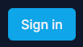
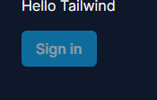
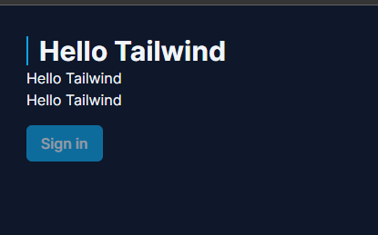
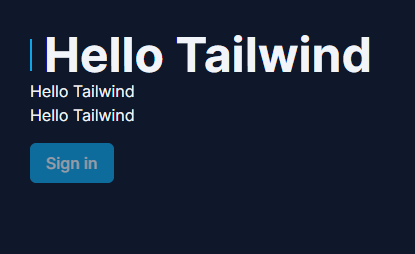

## Pré-requisitos

Instalar no VS Code
[PostCSS Language Support](https://marketplace.visualstudio.com/items?itemName=csstools.postcss)
[Tailwind CSS IntelliSense](https://marketplace.visualstudio.com/items?itemName=bradlc.vscode-tailwindcss)

## Criando um projeto novo

```bash
yarn create next-app <NOME_APP>
```

### Arquivo `tailwind.config.ts`

### content: []

O único bloco obrigatório é o `content: [],`, onde ensina ao onde podem existir arquivos que contenham códigos pro tailwind interpretar.

```ts
import type { Config } from "tailwindcss";

const config: Config = {
  content: [
    "./src/pages/**/*.{js,ts,jsx,tsx,mdx}",
    "./src/components/**/*.{js,ts,jsx,tsx,mdx}",
    "./src/app/**/*.{js,ts,jsx,tsx,mdx}",
  ],
  theme: {
    extend: {
      backgroundImage: {
        "gradient-radial": "radial-gradient(var(--tw-gradient-stops))",
        "gradient-conic":
          "conic-gradient(from 180deg at 50% 50%, var(--tw-gradient-stops))",
      },
    },
  },
  plugins: [],
};
export default config;
```

Para este projeto, como sabemos que só teremos TypeScript, manteremos apenas caminho src com tipo tsx, `./src/**/*.tsx`, conforme o arquivo abaixo:

```ts
import type { Config } from "tailwindcss";

const config: Config = {
  content: [
    "./src/**/*.tsx",
  ],
  theme: {
    extend: {
      backgroundImage: {
        "gradient-radial": "radial-gradient(var(--tw-gradient-stops))",
        "gradient-conic":
          "conic-gradient(from 180deg at 50% 50%, var(--tw-gradient-stops))",
      },
    },
  },
  plugins: [],
};
export default config;
```

### theme: []

Neste bloco podemos definir tudo que definimos como padrão do projeto, inclusive criando os nossos novos.

--- 

This is a [Next.js](https://nextjs.org/) project bootstrapped with [`create-next-app`](https://github.com/vercel/next.js/tree/canary/packages/create-next-app).

## Psdeudo seletores

Opçoes de selecionar somente a primeira , letra, ultimo elemento e assim por diante.

NOTA: A propriedade flex por padrão, faz os elementos ficarem um ao lado do outro.

## Botoes

Podemos criar normalmente um botão usando as tag nutton e o estilo podemos definir no elemento como no exemplo:

```tsx
      <button className="bg-sky-500 px-4 py-2 rounded-md font-medium mt-4">
        Sign in
      </button>
```



### Estados

Podemos alterar os estados, usando este tipo especial de propriedade

```tsx
      <button disabled className="
       bg-sky-500 px-4 py-2 rounded-md font-medium mt-4
       enabled:hover:bg-sky-600
       disabled:opacity-60 disabled:cursor-not-allowed
       ">
```

Defimos o comportamento do estilo do botão caso habilitado, desabilitado, e como o elemento se comporta quando o mouse esta sobre ele.



## Estilos

Mobile First, o sistema é feito pensando em mobile por padrão, depois costumizamos para telas maiores.

### Resposividade

Para alterar por exemplo o estilo de um elemento, caso a tela mude de cor, podemos usar `sm:` e o nome da propriedade.

```tsx
<h1 className="
        font-bold text-3xl flex items-center gap-3 
        before:w-0.5 before:h-8 before:bg-sky-500
        sm:text-5xl
      ">Hello Tailwind</h1>
```

H1 em tela pequena.


H1 em tela média.


## Getting Started

First, run the development server:

```bash
npm run dev
# or
yarn dev
# or
pnpm dev
# or
bun dev
```

Open [http://localhost:3000](http://localhost:3000) with your browser to see the result.

You can start editing the page by modifying `app/page.tsx`. The page auto-updates as you edit the file.

This project uses [`next/font`](https://nextjs.org/docs/basic-features/font-optimization) to automatically optimize and load Inter, a custom Google Font.

## Learn More

To learn more about Next.js, take a look at the following resources:

- [Next.js Documentation](https://nextjs.org/docs) - learn about Next.js features and API.
- [Learn Next.js](https://nextjs.org/learn) - an interactive Next.js tutorial.

You can check out [the Next.js GitHub repository](https://github.com/vercel/next.js/) - your feedback and contributions are welcome!

## Deploy on Vercel

The easiest way to deploy your Next.js app is to use the [Vercel Platform](https://vercel.com/new?utm_medium=default-template&filter=next.js&utm_source=create-next-app&utm_campaign=create-next-app-readme) from the creators of Next.js.

Check out our [Next.js deployment documentation](https://nextjs.org/docs/deployment) for more details.
